# Burger Queen (API Client) 🍔👑

## Índice

* [1. Preámbulo](#1-preámbulo)
* [2. Resumen del proyecto](#2-resumen-del-proyecto)
* [3. Construido con](#3-construido-con)

***

## 1. Preámbulo

Un pequeño restaurante de hamburguesas, que está creciendo, necesitaba un
sistema a través del cual puedan tomar pedidos usando una _tablet_, y enviarlos
a la cocina para que se preparen ordenada y eficientemente.

Este proyecto tiene dos áreas: interfaz (cliente) y API (servidor). Nuestra
clienta nos solicitó desarrollar la interfaz que se integre con la API.

## 2. Resumen del proyecto

Burger Queen es una web app que consume una [API](https://github.com/Roxana-Vargas/LIM015-burger-queen-api), haciendo uso de React,
la que cuenta con las siguientes secciones:

* Login
* Usuarios (donde se puede ver la lista total de usuarios, crear nuevos usuarios, actualizarlos y eliminarlos).
* Productos (donde se puede ver la lista total de productos, crear nuevos productos, actualizarlos y eliminarlos).
* Órdenes (donde el camarero puede ver el menú disponible en el restaurante y tomar pedidos, ver cuáles son las órdenes.
que el cheff ha marcado como listas para ser entregadas, además, actualizar el estado de las órdenes y marcarlas como entregadas o canceladas).
* Estado de las órdenes (donde el cheff puede ver las órdenes pendientes y actualizar el estado de estas a listas para ser entregadas).
* Perfil (donde el usuario puede actualizar su correo o contraseña)

### 2.1. Secciones

#### Login

Para iniciar sesión en la web app se de ingresar el correo y contraseña que el administrador previamente ha registrado en el sistema. 

Se puede acceder con el siguiente correo y contraseña del administrador:

```
  * Correo: admin@localhost.com
  * Contraseña: adminapi
```

<p align="center">
  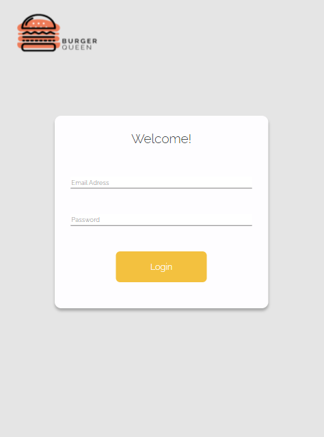
</p>

#### Menu

<p align="center">
  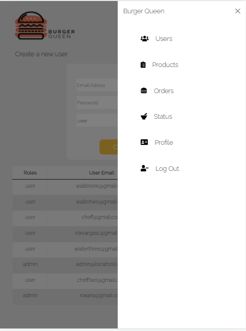
</p>

#### Usuarios
Las diferentes acciones que se pueden realizar en esta sección necesitan que el usuario que ingrese sea administrador, el cual puede realizar lo siguiente:

* Observar la lista total de usuarios.
* Crear nuevos usuarios
* Actualizar el correo o rol de un usuario
* Eliminar un usuario

<p align="center">
  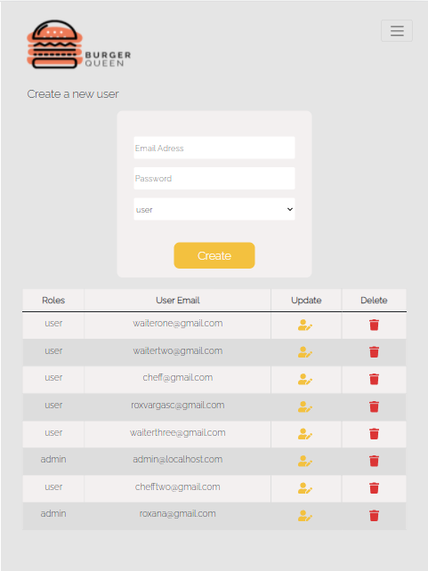
  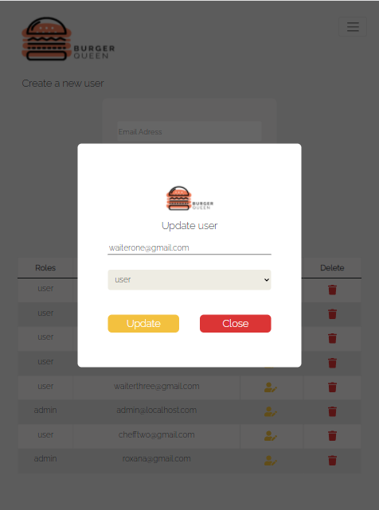
  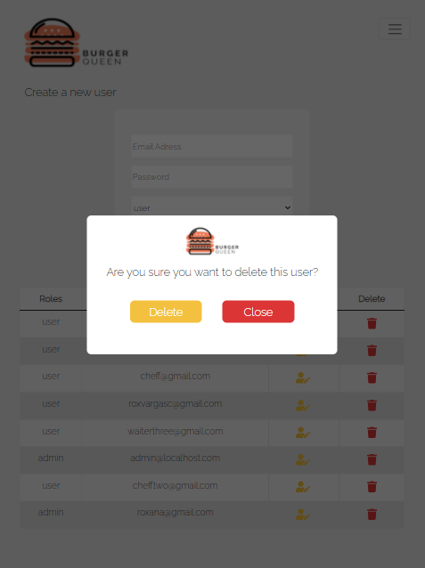
</p>

#### Productos
Las diferentes acciones que se pueden realizar en esta sección necesitan que el usuario que ingrese sea administrador, el cual puede realizar lo siguiente:

* Ver el listado total de productos
* Crear nuevos productos
* Actualizar los datos de un producto
* Eliminar un producto

<p align="center">
  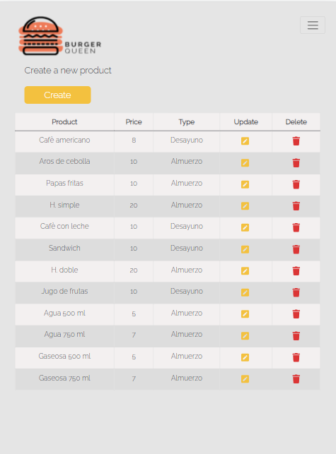
  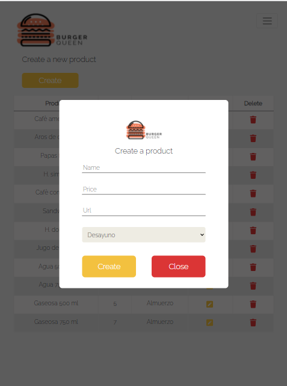
  
  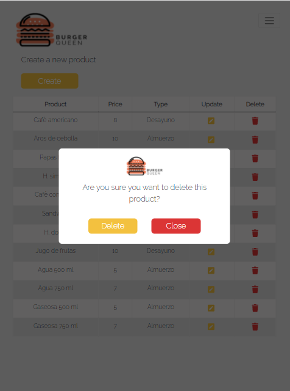
</p>

#### Órdenes

En esta vista, el camarero puede realizar las siguiente acciones:

* Ver el menú, los productos que pertenecen al desayuno y los que pertenecen al almuerzo
* Agregar productos al carrito de compras
* Eliminar un producto del carrito antes de mandarlo a preparar
* Ver el costo total de la orden. 
* Ver el listado de todas las órdenes pendientes o que ya están listas para ser entregadas
* Actualizar el estado de una orden ya sea a entregada o cancelada. 

<p align="center">
  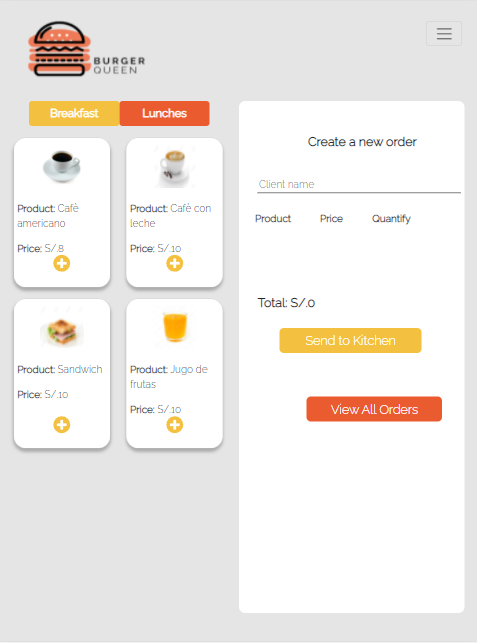
  
  
  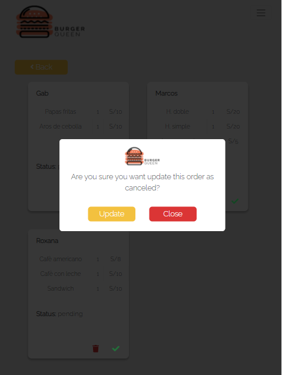
  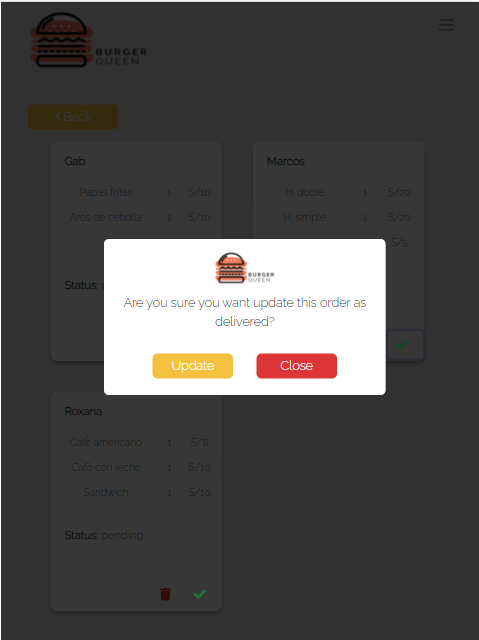
</p>

#### Estado de las órdenes

En esta vista, el chef puede realizar las siguientes acciones:

* Ver el listado de las órdenes pendientes.
* Actualizar el estado de las órdenes a listas para ser entregadas, y que esto se visualice para la vista del camarero. 

<p align="center">
  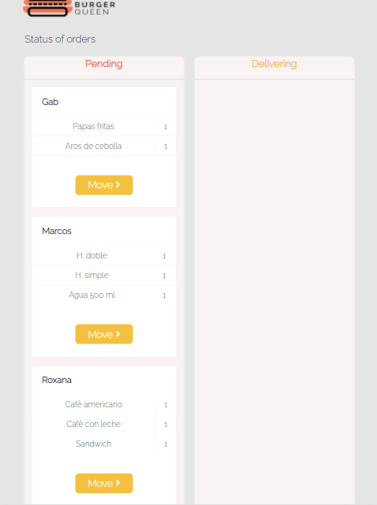
  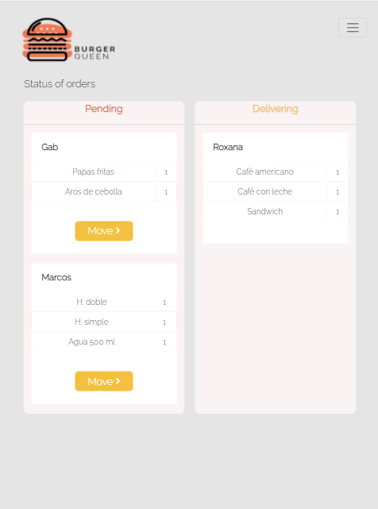
  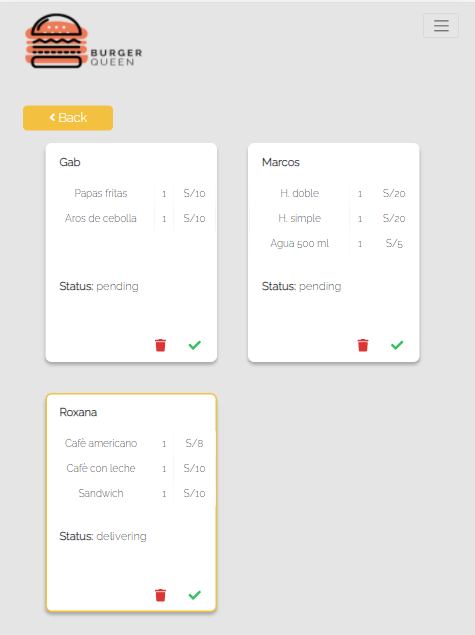
</p>

#### Perfil

En esta vista, el usuario puede realizar las siguientes acciones:

* Ver su información personal (correo y rol)
* Actualizar su correo o contraseña.  

<p align="center">
  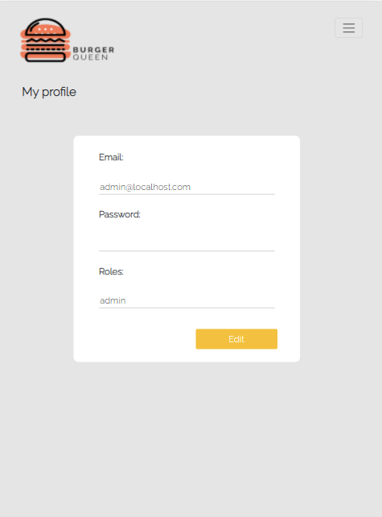
  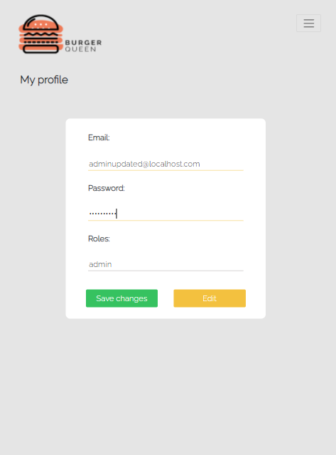
</p>


## 3. Construido con

* React js
* API - creación propia
* CSS


